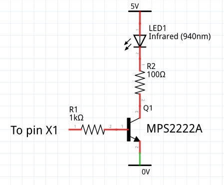
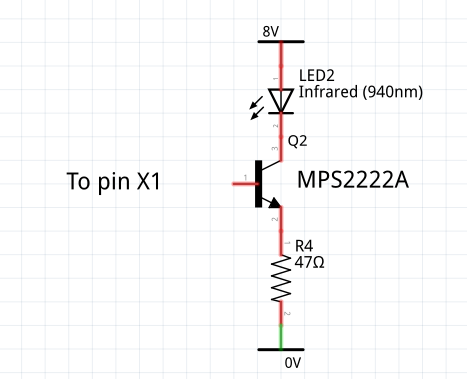

# IR Transmitter

##### [Main README](./README.md#1-ir-communication)

# 1. Hardware Requirements

The transmitter requires a Pyboard 1.x (not Lite), a Pyboard D or an ESP32.
Output is via an IR LED which needs a simple circuit to provide sufficient
current. Typically these need 50-100mA of drive to achieve reasonable range and
data integrity. A suitable 940nm LED is [this one](https://www.adafruit.com/product/387).

On the Pyboard the transmitter test script assumes pin X1 for IR output. It can
be changed, but it must support Timer 2 channel 1. Pins for pushbutton inputs
are arbitrary: X3 and X4 are used. The driver uses timers 2 and 5.

On ESP32 the demo uses pin 23 for IR output and pins 18 and 19 for pushbuttons.
These pins may be changed. The only device resource used is `RMT(0)`.

On Raspberry Pi Pico the demo uses pin 17 for IR output and pins 18 and 19 for
pushbuttons. These pins may be changed. The driver uses the PIO to emulate a
device similar to the ESP32 RMT. The device driver is
[documented here](./RP2_RMT.md); this is for experimenters and those wanting to
use the library in conjunction with their own PIO assembler code.

## 1.1 Wiring

All microcontrollers require an external circuit to drive the LED. The notes
below on specific microcontrollers assume that such a circuit is used.

I use the following circuit which delivers just under 40mA to the diode. R2 may
be reduced for higher current.  


This alternative delivers a constant current of about 53mA if a higher voltage
than 5V is available. R4 determines the current value and may be reduced to
increase power.  


The transistor type is not critical.

The driver assumes circuits as shown. Here the carrier "off" state is 0V,
which is the driver default. If using an alternative circuit where "off" is
required to be 3.3V, the class variable `active_high` should be set `False`.

## 1.2 ESP32 Wiring

The ESP32 RMT device now supports the carrier option, and this driver has been
updated to use it. The same circuits as above may be used to connect to pin 23
(or other pin, if the code has been adapted). The `active_high` option is not
available on the ESP32 `RMT` object, so any alternative circuit must illuminate
the LED if the pin state is high.

## 1.3 RP2 Wiring

There is no `active_high` option so the circuit  must illuminate the LED if the
pin state is high, as per the above drivers. Test programs use pin 17, but this
can be reassigned.

# 2. Dependencies and installation

## 2.1 Dependencies

The device driver has no dependencies.

On ESP32 a firmware version >= V1.17 is required.

The demo program uses `uasyncio` primitives from
[this repo](https://github.com/peterhinch/micropython-async). These may be
installed with
```bash
$ mpremote mip install "github:peterhinch/micropython-async/v3/primitives"
```

## 2.2 Installation

The transmitter is a Python package. This minimises RAM usage: applications
only import the device driver for the protocol in use. It may be installed using
 [mpremote](https://docs.micropython.org/en/latest/reference/mpremote.html) on
 the PC:
```bash
$ mpremote mip install "github:peterhinch/micropython_ir/ir_tx"
```
The demo is of a 2-button remote controller with auto-repeat. It may be run by
issuing:
```python
from ir_tx.test import test
```
Instructions will be displayed at the REPL.

# 3. The driver

This is specific to Pyboard D, Pyboard 1.x (not Lite), ESP32 and Raspberry Pi
Pico (RP2 architecture chip).

It implements a class for each supported protocol, namely `NEC`, `SONY_12`,
`SONY_15`, `SONY_20`, `RC5` and `RC6_M0`.  Each class is subclassed from a
common abstract base class in `__init__.py`. The application instantiates the
appropriate class and calls the `transmit` method to send data.

Basic usage on a Pyboard:
```python
from machine import Pin
from ir_tx.nec import NEC
nec = NEC(Pin('X1'))
nec.transmit(1, 2)  # address == 1, data == 2
```
Basic usage on ESP32:
```python
from machine import Pin
from ir_tx.nec import NEC
nec = NEC(Pin(23, Pin.OUT, value = 0))
nec.transmit(1, 2)  # address == 1, data == 2
```
Basic usage on Pico:
```python
from machine import Pin
from ir_tx.nec import NEC
nec = NEC(Pin(17, Pin.OUT, value = 0))
nec.transmit(1, 2)  # address == 1, data == 2
```

#### Common to all classes

Constructor args:  
 1. `pin` A Pin instance instantiated as an output. On a Pyboard this is a
 `pyb.Pin` instance supporting Timer 2 channel 1: `X1` is employed by the test
 script. On ESP32 any `machine.Pin` may be used. Must be connected to the IR
 diode as described below.
 2. `freq=default` The carrier frequency in Hz. The default for NEC is 38000,
 Sony is 40000 and Philips is 36000.
 3. `verbose=False` If `True` emits (a lot of) debug output.

Methods:
 1. `transmit(addr, data, toggle=0, validate=False)` Args `addr`, `data` and
 `toggle` are positive integers. The maximum vaues are protocol dependent. If
 `validate` is `True` passed values are checked and a `ValueError` raised if
 they are out of range. If `validate` is false invalid bits are silently
 discarded. For example if an address of 0x11 is passed to `MCE.transmit`, the
 address sent will be 1 because that protocol supports only a four bit address
 field. The `toggle` field is unused by some protocols when 0 should be passed.
 2. `busy()` Returns `True` while data is being transmitted.

Class method:
 1. `active_low` No args. Pyboard only. A `ValueError` will be thrown on ESP32.
 The IR LED drive circuit is usually designed to turn the LED on if the driver
 pin is high. If it has opposite polarity the method must be called before
 instantiating the class - it will be ineffective if called later.

Class varaible:
 1. `timeit=False` If `True` the `.transmit` method times itself and prints the
 result in μs.

The `transmit` method is synchronous with rapid return. Actual transmission
occurs as a background process, on the Pyboard controlled by timers 2 and 5. On
ESP32 the RMT class is used and on RP2 the PIO is used to emulate the RMT. If
`transmit` is called while a prior transmission is in progress, it will block
until the transmission is complete before commencing the next. Blocking can be
avoided by checking the `busy` status prior to starting a transmission. Note
that sending bursts in quick succession may confuse the receiving device: these
are typically designed for a transmitter that sends a burst in response to a
button press with a gap likely to be well over 100ms.

Execution times were measured on a Pyboard 1.1 and the ESP32 reference board
without SPIRAM. Tests were done at stock frequency and with `validate=True`,
`verbose=False`. A small saving could be achieved by skipping validation.

| Protocol | ESP32 | Pyboard |
|:--------:|:-----:|:-------:|
| NEC      | 7.8ms | 3.2ms   |
| SONY12   | 3.2ms | 1.3ms   |
| SONY15   | 3.6ms | 1.5ms   |
| SONY20   | 4.5ms | 1.9ms   |
| RC5      | 4.9ms | 1.5ms   |
| RC6_M0   | 6.0ms | 2.0ms   |
| MCE      | 6.7ms | 2.0ms   |

#### NEC class (also Samsung)

Class `NEC`. Example invocation:
```python
from ir_tx.nec import NEC
```

This has an additional method `.repeat` (no args). This causes a repeat code to
be transmitted. Should be called every 108ms if a button is held down.

The NEC protocol accepts 8 or 16 bit addresses. In the former case, a 16 bit
value is transmitted comprising the 8 bit address and its one's complement,
enabling the receiver to perform a simple error check. The `NEC` class supports
these modes by checking the value of `addr` passed to `.transmit` and sending
the complement for values < 256.

A value passed in `toggle` is ignored.

For Samsung protocol set the `samsung` class variable `True`:
```python
from ir_tx.nec import NEC
NEC.samsung=True
```
Samsung remotes do not seem to use repeat codes: the sample I have simply
repeats the original code.

Thanks are due to J.E.Tannenbaum for information about the Samsung protocol.

#### Sony classes

Classes `SONY_12`, `SONY_15` and `SONY_20`. Example invocation:
```python
from ir_tx.sony import SONY_15
```

The SIRC protocol supports three sizes, supported by the following classes:
 1. 12 bit (7 data, 5 address) `SONY_12`
 2. 15 bit (7 data, 8 address) `SONY_15`
 3. 20 bit (7 data, 5 addresss, 8 extended) `SONY_20`

The `.transmit` method masks `addr` and `data` values to the widths listed
above. `toggle` is ignored except by `SONY_20` which treats it as the extended
value.

#### Philips classes

Classes `RC5` and `RC6_M0`. Example invocation:
```python
from ir_tx.philips import RC5
```

The RC-5 protocol supports a 5 bit address and 6 or 7 bit (RC5X) data. The
driver uses the appropriate mode depending on the `data` value provided.

The RC-6 protocol accepts 8 bit address and data values.

Both send a `toggle` bit which remains constant if a button is held down, but
changes when the button is released. The application should implement this
behaviour, setting the `toggle` arg of `.transmit` to 0 or 1 as required.

#### Microsoft MCE class

Class `MCE`. Example invocation:
```python
from ir_tx.mce import MCE
# MCE.init_cs = 3
```
There is a separate demo for the `MCE` class because of the need to send a
message on key release. It is run by issuing:
```python
from ir_tx.mcetest import test
```
Instructions will be displayed at the REPL.

I have been unable to locate a definitive specification: the protocol was
analysed by a mixture of googling and experiment. Behaviour may change if I
acquire new information. The protocol is known as OrtekMCE and the remote
control is sold on eBay as VRC-1100.

The remote was designed for Microsoft Media Center and is used to control Kodi
on boxes such as the Raspberry Pi. With a suitable PC driver it can emulate a
PC keyboard and mouse. The mouse emulation uses a different protocol: the class
does not currently support it. Pressing mouse buttons and pad will cause the
error function (if provided) to be called.

This supports a 4 bit address, 6 bit data and 2 bit toggle. The latter should
have a value of 0 for the first message, 1 for repeat messages, and 2 for a
final message sent on button release.

The remaining four bits are a checksum which the driver creates. The algorithm
requires an initial 'seed' value which my testing proved to be 4. However the
only [documentation](http://www.hifi-remote.com/johnsfine/DecodeIR.html#OrtekMCE)
I could find stated that the value should be 3. I implemented this as a class
variable `MCE.init_cs=4`. This enables it to be changed if some receivers
require 3.

# 4. Principle of operation

The classes inherit from the abstract base class `IR`. This has an array `.arr`
to contain the duration (in μs) of each carrier on or off period. The
`transmit` method calls a `tx` method of the subclass which populates this
array. This is done by two methods of the base class, `.append` and `.add`. The
former takes a list of times (in ) and appends them to the array. A bound
variable `.carrier` keeps track of the notional on/off state of the carrier:
this is required for bi-phase (manchester) codings.

The `.add` method takes a single μs time value and adds it to the last value
in the array: this pulse lengthening is used in bi-phase encodings.

On completion of the subclass `.tx`, `.transmit` calls `.trigger` which
initiates transmission as a background process. Its behaviour is platform
dependent.

## 4.1 Pyboard

Tramsmission is performed by two hardware timers initiated in the constructor.
Timer 2, channel 1 is used to configure the output pin as a PWM channel. Its
frequency is set in the constructor. The OOK is performed by dynamically
changing the duty ratio using the timer channel's `pulse_width_percent` method:
this varies the pulse width from 0 to the duty ratio passed to the constructor.

The duty ratio is changed by the Timer 5 callback `._cb`. This retrieves the
next duration from the array. If it is not `STOP` it toggles the duty cycle
and re-initialises T5 for the new duration. If it is `STOP` it ensures that the
duty ratio is set to the `_SPACE`

Here `.trigger` appends a special `STOP` value and initiates physical
transmission by calling the Timer5 callback.

## 4.2 ESP32

The RMT class now supports `carrier_freq` and `carrier_duty_percent`
constructor args, so the base class `IR` (in `__init__.py`) uses these to
enable the OOK (on-off keying) waveform.

The `.trigger` method calls `RMT.write_pulses` and returns with `RMT` operating
in the background.

## 4.3 Duty ratio

In every case where I could find a specified figure it was 30%. I measured
that from a variety of remotes, and in every case it was close to that figure.

# 5. Unsupported protocols

You can use the receiver module to capture an IR burst and replay it with the
transmitter. This enables limited support for unknown protocols. This is
strictly for experimenters and I haven't documented it in detail.

There are two limitations. The first is timing accuracy: both receiving and
transmitting processes introduce some timing uncertainty. This is only likely
to be a practical problem with fast protocols. In brief testing with a known
protocol the scripts below worked.

The more tricky problem is handling repeat keys: different protocols use widely
varying approaches. If repeat keys are to be supported some experimentation and
coding is likely to be required.

The following captures a single burst and saves it to a file:  
```python
from ir_rx.acquire import test
import ujson

lst = test()  # May report unsupported or unknown protocol
with open('burst.py', 'w') as f:
    ujson.dump(lst, f)
```
This replays it:  
```python
from ir_tx import Player
from sys import platform
import ujson

if platform == 'esp32':
    from machine import Pin
    pin = (Pin(23, Pin.OUT, value = 0), Pin(21, Pin.OUT, value = 0))
else:
    from pyb import Pin, LED
    pin = Pin('X1')
with open('burst.py', 'r') as f:
    lst = ujson.load(f)
ir = Player(pin)
ir.play(lst)
```
The `ir_tx.Player` class is a minimal subclass supporting only the `.play`
method. This takes as an arg an iterable comprising time values of successive
mark and space periods (in μs).

The `ir_rx.acquire.test` function makes assumptions about the likely maximum
length and maximum duration of a burst. In some cases this may require some
modification e.g. to instantiate `IR_GET` with different args.
